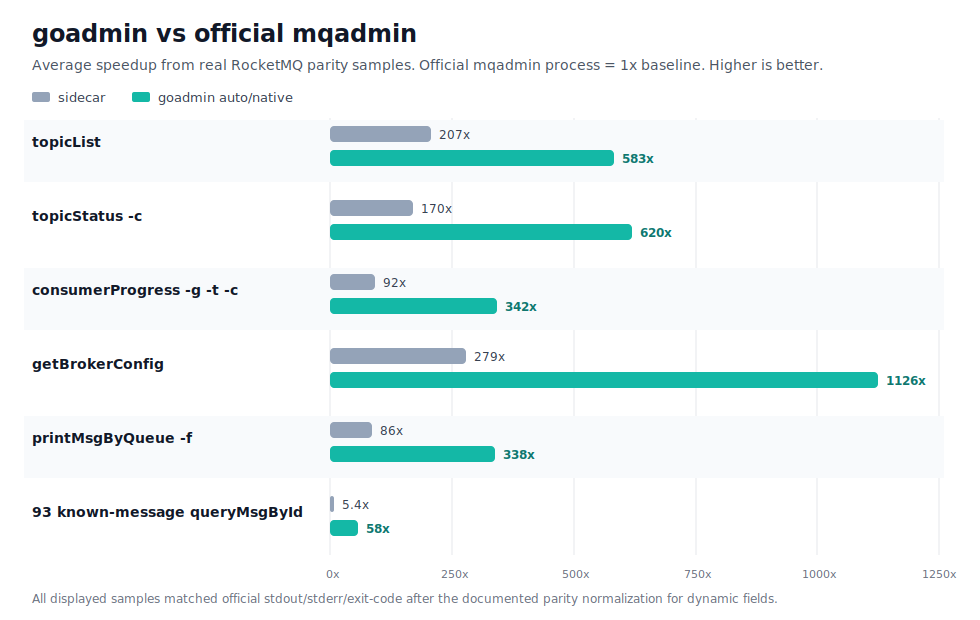

# RocketMQ Go Dashboard

一个用 Go 写的 RocketMQ Dashboard 和 `goadmin` CLI。

## 能做什么

- 浏览集群、Topic、Consumer 和消息链路
- 通过 `goadmin` 执行和官方 `mqadmin` 兼容的只读命令
- 支持 Docker 部署

## 性能对比

`goadmin` 的目标是保持官方 `mqadmin` 输出兼容，同时减少每次命令都启动 JVM tools 进程的开销。下图使用同一套 Docker 验证环境中的真实 RocketMQ 样本，展示项均已完成 stdout/stderr/exit-code 对官方输出的 diff 对齐。



| 场景 | 官方 `mqadmin` 平均耗时 | `goadmin` auto/native 平均耗时 | 加速比 |
| --- | ---: | ---: | ---: |
| `topicList` | 4312 ms | 7.4 ms | 583x |
| `topicStatus -c` | 4465 ms | 7.2 ms | 620x |
| `consumerProgress -g -t -c` | 3970 ms | 11.6 ms | 342x |
| `getBrokerConfig` | 7205 ms | 6.4 ms | 1126x |
| `printMsgByQueue -f` | 3985 ms | 11.8 ms | 338x |
| 93 条 `queryMsgById` 真实消息批量对照 | 5867 ms | 101 ms | 58x |

数值会随机器、容器和 Broker 状态波动，建议主要看同环境下的相对差异：官方进程路径稳定在秒级，Go 原生路径通常在个位到几十毫秒级。

完整命令级对比表见 [docs/performance.md](docs/performance.md)，当前公开表共收录 156 条命令/场景，包含官方 `mqadmin`、sidecar/兼容路径和 Go 原生路径的平均耗时与 diff 结果。

## 快速开始

```powershell
go run ./cmd/rmqdash
```

默认连接本机 RocketMQ NameServer：

```text
127.0.0.1:9876
```

如果要启动 Docker：

```powershell
docker compose up -d --build
```

Docker Compose 默认使用 `host.docker.internal:9876` 连接宿主机 NameServer。部署到服务器时可以通过 `RMQD_NAMESRV` 覆盖。

## 环境变量

- `RMQD_ADDR`
- `RMQD_NAMESRV`
- `RMQD_NAMESRV_OPTIONS`
- `RMQD_ADMIN_PROVIDER`
- `RMQD_ADMIN_SIDECAR_ENABLED`

更多参数见 [docs/docker_deploy.md](docs/docker_deploy.md)。

## 目录

- `cmd/goadmin`：CLI 入口
- `cmd/rmqdash`：Dashboard 入口
- `internal/rocketmq`：RocketMQ 适配层
- `internal/server`：HTTP 服务
- `org/apache/rocketmq`：保留的 Apache RocketMQ 依赖源码

## 许可证

Apache-2.0
